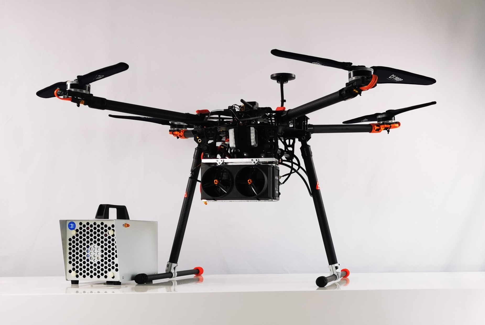

.. _common-ie650-fuelcell:

======================================
Intelligent Energy Fuel Cell 650W/800W
======================================

This page explains how to connect Intelligent Energy's 650W and 800W fuel cells to ArduPilot.  Telemetry from the fuel cell is transmitted via serial to ArduPilot.  This gives the following feedback:

- Hydrogen tank level as a percentage.
- Battery remaining as a percentage.
- Fuel cell state.
- Error codes.

Setup
-----

Enable the fuel cell driver by setting `GEN_TYPE <GEN_TYPE>` to 1.

Fuel cell telemetry is transmitted over serial.  As such, the appropriate serial port needs to be configured to receive fuel cell data.  Set the `SERIALX_PROTOCOL <SERIAL1_PROTOCOL>` parameter to 30 for generator.

The generator library utilises the battery monitor mavlink messages to display fuel cell telemetry on the ground station.  Two Battery monitor instances are required for one fuel cell.  One for the fuel tank and another for the battery.  Set `BATTX_MONITOR <BATT_MONITOR>` parameter to 17 for the fuel cells electrical data.  Set another `BATTX_MONITOR <BATT_MONITOR>` parameter to 18 for the hydrogen tank telemetry.

This fuel cell unit only reports battery percentage remaining and tank percentage remaining.  As such the following parameters must be set for both tank and battery:

- `BATT<X>_CAPACITY <BATT_CAPACITY>` = 100 must be set to give a sensible readout of a percentage on the GCS.

- Capacity related failsafes can be set using `BATTX_LOW_MAH <BATT_LOW_MAH>` = 0, `BATTX_CRT_MAH <BATT_CRT_MAH>` = 0, `BATTX_ARM_MAH <BATTX_ARM_MAH>` = 0.

Reboot the flight controller after setting the parameters for the settings to take affect.

.. tip::
    In this instance, ignore the units of these parameters.  The capacities are only reported as a percentage.  As such values should be entered in the range from 1 to 100.

.. note::
    No voltage data is available for these units and a fixed voltage of 1 V is always reported.  To avoid low voltage pre-arm warnings and failsafes `BATTX_ARM_VOLT <BATT_ARM_VOLT>` = 0, 'BATTX_LOW_VOLT <BATT_LOW_VOLT>` = 0, and `BATTX_CRT_VOLT <BATT_CRT_VOLT>` = 0 must be set to disable voltage related failsafes on this model.  

Fuel Cell Status
----------------

The fuel cell reports status over the telemetry.  The status levels are:

- Starting
- Ready
- Running
- Fault
- Battery Only

A message will be displayed on the GCS and in the flight log whenever the fuel cell status changes.  The vehicle can only be armed when the fuel cell is reporting a status of `Running'.

Failsafes and Pre-Arm Checks
----------------------------

Failsafes and pre-arm checks are hard-coded and based on the error codes sent by the fuel cell.  Failsafes have been seperated into two groups: Low and Critical.  The error code groups are listed below.  If an error code is recieved from the fuel cell, the resulting failsafe action will be set by the `BATTX_FS_LOW_ACT <BATT_FS_LOW_ACT>` and `BATTX_FS_CRT_ACT <BATT_FS_CRT_ACT>` respectively.

.. Note::
    Monitoring of the fuel cell's internal error codes for pre-arm checks and failsafes are only done on the battery monitor instance allocated for the electrical telemetry recieved from the fuel cell.  The electrical battery monitor instance must therefore be set to trigger failsafes based on error codes.

Falisafe Low Action Error Code Group
++++++++++++++++++++++++++++++++++++

.. raw:: html

   <table border="1" class="docutils">
   <tbody>

   <tr>
   <th>Error Code</th>
   <th>Definition</th>
   </tr>

   <tr>
   <td>0x4000000</td>
   <td>Fan over current (> 0.25 A)</th>
   </tr>

   <tr>
   <td>0x100000</td>
   <td>Fuel cell's internal State is set 'stop' for > 15 s</th>
   </tr>

   <tr>
   <td>0x20000</td>
   <td>Tank pressure < 15 barg</th>
   </tr>

   <tr>
   <td>0x2000</td>
   <td>Stack 1 under temperature (< 5 degC)</th>
   </tr>

   <tr>
   <td>0x1000</td>
   <td>Stack 2 under temperature (< 5 degC)</th>
   </tr>

   <tr>
   <td>0x800</td>
   <td>Battery under voltage warning (21.6 V)</th>
   </tr>

   <tr>
   <td>0x200</td>
   <td>Fan pulse aborted</th>
   </tr>

   <tr>
   <td>0x100</td>
   <td>Stack under voltage (650 W < 17.4V, 800 W < 21.13 V)</th>
   </tr>

   <tr>
   <td>0x80</td>
   <td>Stack under voltage and battery power below threshold (< -200 W)</th>
   </tr>

   <tr>
   <td>0x10</td>
   <td>Battery charger fault</th>
   </tr>

   <tr>
   <td>0x8</td>
   <td>Battery undertemperature (< -15 degC)</th>
   </tr>

   </tbody>
   </table>

Falisafe Critical Action Error Code Group
+++++++++++++++++++++++++++++++++++++++++

.. raw:: html

   <table border="1" class="docutils">
   <tbody>

   <tr>
   <th>Error Code</th>
   <th>Definition</th>
   </tr>

   <tr>
   <td>0x80000000</td>
   <td>Stack 1 over temperature alert (>58 degC)</td>
   </tr>

   <tr>
   <td>0x40000000</td>
   <td>Stack 2 over temperature alert (>58 degC)</td>
   </tr>

   <tr>
   <td>0x20000000</td>
   <td>Battery undervolt alert (<19 V)</td>
   </tr>

   <tr>
   <td>0x10000000</td>
   <td>Battery over temperature alert (>65 degC)</td>
   </tr>

   <tr>
   <td>0x8000000</td>
   <td>No fan current detected (<0.01 A)</td>
   </tr>

   <tr>
   <td>0x2000000</td>
   <td>Stack 1 over temperature critical (>57 degC)</td>
   </tr>

   <tr>
   <td>0x1000000</td>
   <td>Stack 2 over temperature critical (>57 degC)</td>
   </tr>

   <tr>
   <td>0x800000</td>
   <td>Battery undervolt warning (<19.6 V)</td>
   </tr>

   <tr>
   <td>0x400000</td>
   <td>Battery over temperature warning (>60 degC)</td>
   </tr>

   <tr>
   <td>0x200000</td>
   <td>Fuel cell's internal State == start for > 30 s</td>
   </tr>

   <tr>
   <td>0x80000</td>
   <td>Tank pressure < 6 barg</td>
   </tr>

   <tr>
   <td>0x40000</td>
   <td>Tank pressure < 5 barg</td>
   </tr>

   <tr>
   <td>0x10000</td>
   <td>Fuel cell's internal saftey flags not set true</td>
   </tr>

   <tr>
   <td>0x8000</td>
   <td>Stack 1 denied start</td>
   </tr>

   <tr>
   <td>0x4000</td>
   <td>Stack 2 denied start</td>
   </tr>

   <tr>
   <td>0x400</td>
   <td>Battery under voltage (21.6 V) and master denied</td>
   </tr>

   <tr>
   <td>0x40</td>
   <td>Over voltage and over current protection</td>
   </tr>

   <tr>
   <td>0x20</td>
   <td>Invalid serial number</td>
   </tr>

   </tbody>
   </table>

Example
+++++++
This example has been provided to make it clear how the failsafe actions are set.

The battery monitors have been configured so that electrical telemetry data is on battery monitor 1 and hydrogen tank telemetry is on battery monitor 2:
- `BATT_MONITOR <BATT_MONITOR>` = 17 (electrical data)
- `BATT2_MONITOR <BATT2_MONITOR>` = 18 (tank data)

The failsafe actions that correspond to the error code groups listed above are then set on battery monitor 1 as that is the one associated with the electrical telemetry data.
- `BATT_FS_LOW_ACT <BATT_FS_LOW_ACT>` = 2 (RTL)
- `BATT_FS_CRT_ACT <BATT_FS_CRT_ACT>` = 1 (land)

Driver Not Healthy
------------------

If you see the Generator: Driver Not Healthy message in the GCS then ArduPilot has not received any data packets from the fuel cell for at least 5 seconds.  Check the following for common causes to this issue:
- Fuel cell is powered on
- Telemetry is connected to a flight controller serial port.
- The serial connection is wired correctly (TX->RX, RX->TX).
- The `SERIALX_PROTOCOL <SERIAL1_PROTOCOL>` parameter is set to generator for the correct telemetry port.
